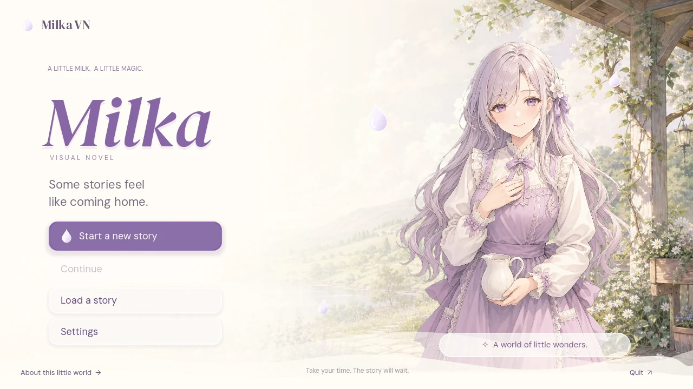
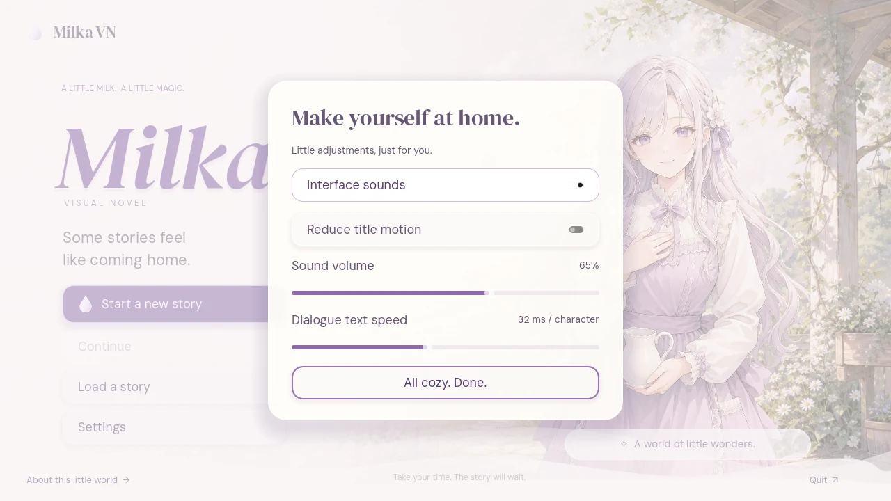
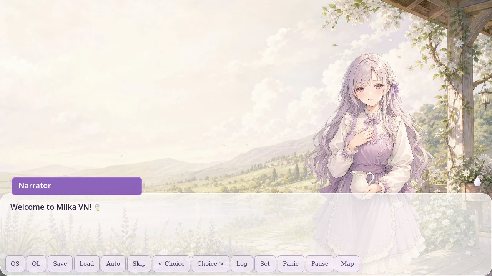

# Milk-glass title initialization

Branch: `milka-init-daisy-clover-27`, based on `milka-init`.

The title, menus and character idle scene are hand-authored Godot resources. No scene-builder script is used. The title controller only handles input, panel visibility, preferences and scene changes. The character is a replaceable illustration, not an agent persona. Milka is treated as a personal name, not the chocolate brand.

## Art and replacement

- `assets/title/meadow.webp`: replaceable AI-generated visual-development scenery.
- `assets/title/character.webp`: replaceable AI-generated character illustration with a transparent chroma-keyed silhouette.
- `assets/ui/milk_drop.svg`, `milk_wave.svg`, `milk_veil.svg`: small, editable vector UI decorations.
- `assets/ui/milk_theme.tres`: translucent rounded buttons, white milk edges, soft shadows and slider styling.
- `assets/fonts/title/`: DM Sans and DM Serif Display, with the SIL Open Font License included.

The VN currently uses the shared title illustration for the neutral/smile/surprised sprite-key aliases. These are **placeholder aliases**, not three new expressions. The inherited SVG expression artwork is retained in `assets/characters/`; update the `sprites` dictionary in `vn_balloon.tscn` with your own final expressions.

## Editable scene structure

- `scenes/title_screen.tscn`: title layout, menu, droplets and authored overlay panels.
- `scenes/title_screen.gd`: interaction controller, not a scene builder.
- `scenes/title_character.tscn`: reusable 2D portrait with an authored looping idle AnimationPlayer.
- `characters/milka_chan.tres`: authored 2D idle/sway/bounce/shake/nod AnimationLibrary.
- `scenes/vn_scene.gd`: hands Continue/Load requests to the existing VN save system.

Start, Continue, Load, Settings, About and Quit are functional. Continue scans arbitrary existing save slots and picks the newest valid save. Empty Load shows a friendly fresh-start panel. Sound, volume, text pace and title-motion preferences persist in `user://milka_title.cfg`. Escape closes title overlays. Interface sound/text pace preferences are passed into the VN.

The GitHub branch contains **only the Godot deliverable**, not React or a browser application.

## Content ownership

No new dialogue words or lore were added. The inherited starter scenario's malformed staging/SFX annotations were normalized to Dialogue Manager's actual bracketed syntax, and cue jumps were corrected. Backgrounds and animated actors now stage and restore correctly.

Use comma-separated tags wrapped in `[# ... ]`, such as `[#bg=milky_meadow, #show=milka_chan@right, #anim=milka_chan:idle?loop]`. Bare hashtags are not metadata. Author your own story in `dialogue/milka.dialogue`; replace the placeholder art and animation resources freely.

## Validation

Tested with **Godot 4.7.2**:

- Editor import: no script errors.
- `tests/test_milk_title.tscn`: **18 passed, 0 failed**.
- `tests/test_milk_start.tscn`: **10 passed, 0 failed**; verifies live 2D idle animation, history, native save, and background restoration.
- Asset guard: packed WebP raster assets; whitelisted project SVGs stay under 8 KB.
- Actual 1280×720 graphical run in **Sway 1.7 / WLR Pixman**, using native Wayland and **Mesa llvmpipe** CPU OpenGL.

The headless Start test reports two resources still in use at forced engine shutdown; assertions pass. The real graphical session has no script errors. Sway's missing optional icon/FIFO protocol warnings and the inherited dialogue-layout anchor warning are non-fatal.

Run the two smoke scenes after importing the project. `tools/validate_milk_title.sh` reproduces title, Settings and dialogue captures; it is a validation tool, not a scene builder. It needs `sway`, `grim`, `wtype`, a Godot 4.7.2 executable (set `GODOT`), and Wayland/EGL/Mesa software-rendering libraries. The script tears down its compositor and game processes automatically.

## Native captures

